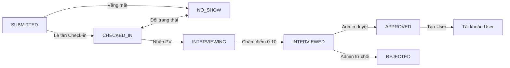
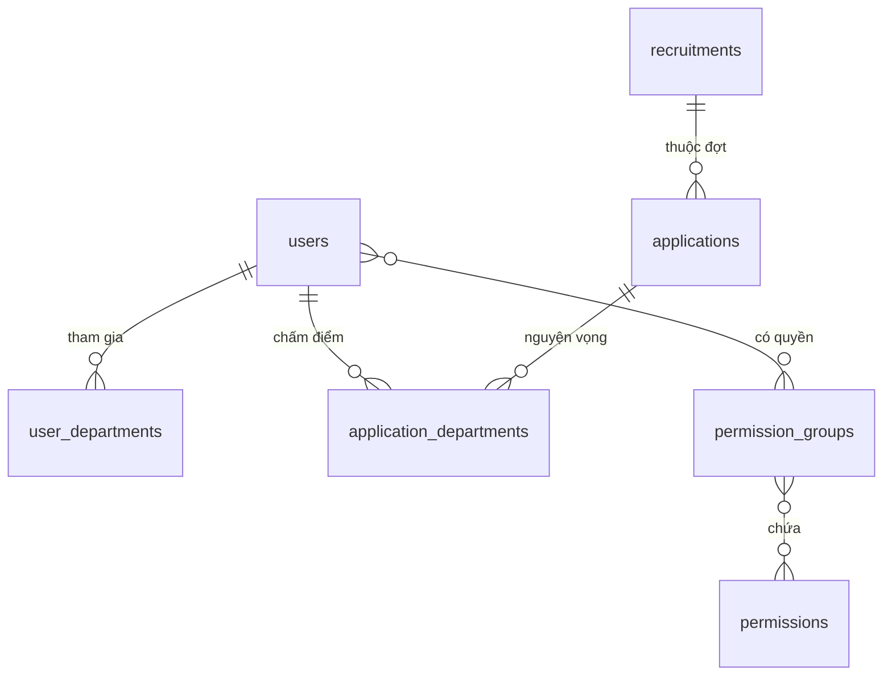

# iStar Backend — Kiến Trúc & Tài Liệu Kỹ Thuật

REST API service quản lý nhân sự, cơ cấu tổ chức và tuyển chọn thành viên cho CLB Nghệ thuật iStar (Đại học Công nghiệp Hà Nội - HaUI).

---

## 1. Công Nghệ & Cấu Trúc Dự Án

- **Core**: Java 21, Spring Boot 4.x (`spring-boot-starter-data-jpa`, `spring-boot-starter-security`, `spring-boot-starter-validation`, `spring-boot-starter-webmvc`).
- **Database & Persistence**: PostgreSQL, Spring Data JPA Auditing (`@CreatedDate`, `@LastModifiedDate`), Optimistic Locking (`@Version`).
- **Security & Auth**: Stateless JWT (JJWT `0.12.6`), BCrypt, RBAC phân quyền hạt nhân (`@PreAuthorize("hasAuthority('...')")`).
- **Tiện ích**: Apache POI (SXSSF streaming Excel), Lombok.

### 1.1 Cấu Trúc Thư Mục Rút Gọn

```
istar-backend/
├── src/main/java/com/haui/istar/
│   ├── IstarApplication.java
│   ├── config/            # SecurityConfig, CorsConfig, GlobalExceptionHandler, DataSeeder
│   ├── controller/
│   │   ├── admin/         # AdminApplication, AdminUser, RecruitmentAdmin, Interview, Reception, Dashboard...
│   │   ├── auth/          # AuthController (register - mặc định inactive, login - cấp JWT)
│   │   ├── publicapi/     # PublicRecruitment, PublicCommonCode
│   │   └── user/          # ApplicationFormController, UserController
│   ├── dto/               # application/, auth/, common/, dashboard/, recruitment/, user/
│   ├── exception/         # BadRequestException, ResourceNotFoundException, UnauthorizedException
│   ├── model/             # Application, ApplicationDepartment, User, UserDepartment, Recruitment, Permission...
│   │   └── enums/         # ApplicationStatus, Department, Position, Role, Area
│   ├── repository/        # UserRepository, ApplicationRepository, RecruitmentRepository...
│   │   └── specification/ # ApplicationSpecification, UserSpecification
│   ├── security/          # JwtTokenProvider, JwtAuthenticationFilter, CustomUserDetailsService, UserPrincipal
│   ├── service/           # Service interfaces & impl/ (AdminApplication, Auth, Interview, Recruitment...)
│   └── util/              # ExcelExporter, FileUploadUtil, ServiceUpdateUtils, UserValidator
└── src/main/resources/    # application.properties (DB, JWT, upload configs)
```

---

## 2. Quy Tắc Nghiệp Vụ & Bất Biến (Domain Invariants)

### 2.1 4 Ban Chuẩn Hóa
Hệ thống cố định đúng 4 ban chính (`Department` enum), không có ban con (`SubDepartment`):
1. `MUSIC` (Ban Âm nhạc)
2. `RAP` (Ban Rap)
3. `MEDIA_AND_EVENT` (Ban Truyền thông và Tổ chức Sự kiện)
4. `DANCE` (Ban Vũ đạo)

### 2.2 Phân Quyền IT (RBAC) & Chức Vụ Tổ Chức (`Position`)
- **Tổ chức (`Position`)**: Cấp CLB (`PRESIDENT`, `VICE_PRESIDENT` - giới hạn quota, cấm cơ sở `NINH_BINH`; `AREA_MANAGER`, `MEMBER`) và cấp Ban (`DEPARTMENT_HEAD` - tối đa 1 người/ban có lock kiểm tra, `MEMBER`). 1 user có thể giữ nhiều chức danh ở các ban khác nhau.
- **Phân quyền IT**: Quản lý qua `PermissionGroup` (tương ứng System Roles: `ADMIN`, `RECEPTIONIST`, `INTERVIEWER`, `REVIEWER`, `MEMBER`) chứa các `Permission` nguyên tử (`PERM_<CODE>`).
- **UserPrincipal Authorities**: Cấp cả prefix `ROLE_<GROUP>` lẫn `PERM_<CODE>` và alias `<CODE>` gốc để tương thích kiểm tra `@PreAuthorize`.
- **CORS & An toàn Sắp xếp**: `SecurityConfig` hỗ trợ `allowedOriginPatterns: http://localhost:*`, `http://127.0.0.1:*`. Các Service kiểm tra null-safe với `sortDirection`, `page`, `size` (giới hạn tối đa 500).

### 2.3 Cơ Chế Đồng Bộ Đa Ban (In-Place Reconciliation)
- Bảng `user_departments` có ràng buộc unique `(user_id, department)`.
- **Quy tắc**: Vì Hibernate `ActionQueue` thực thi INSERT trước DELETE, không dùng `clear()` rồi `addAll()`. Luôn reconciliation tại chỗ:
  1. `removeIf` các ban bị bỏ (kích hoạt `orphanRemoval = true`).
  2. Cập nhật `position` của ban giữ nguyên (lệnh UPDATE, không xóa thực thể).
  3. Chỉ INSERT ban mới phát sinh.

### 2.4 Vòng Đời Đơn Tuyển & Phỏng Vấn (Application Lifecycle)



- **Tự động gán đợt tuyển**: `POST /api/auth/applications` tự bind vào đợt đang active (`findByIsActiveTrueAndIsDeletedFalse()`). Nếu không có đợt active ➜ HTTP 400.
- **Khóa tranh chấp phỏng vấn đa ban**: Khi 1 ban nhận PV (`start-multi`), đơn và ban chuyển `INTERVIEWING`. Ban khác không thể nhận đồng thời. Khi hoàn tất (`complete-multi`): nếu tất cả các ban của ứng viên đạt `INTERVIEWED` ➜ đơn chuyển `INTERVIEWED`; nếu còn ban khác `CHECKED_IN` ➜ đơn hoàn về `CHECKED_IN` để ban còn lại phỏng vấn tiếp.
- **Enum Deserialization**: `ApplicationStatus` có `@JsonCreator` (`fromString`) và `@JsonValue` (`toValue`), hỗ trợ cả mã code lẫn text tiếng Việt.
- **Mốc thời gian Check-in & Hoàn tất PV**:
  - `checkedInAt`: Tự động ghi nhận `LocalDateTime.now()` khi lễ tân/admin thực hiện check-in đơn.
  - `interviewedAt`: Tự động ghi nhận `LocalDateTime.now()` khi tất cả các ban của ứng viên hoàn tất phỏng vấn (`INTERVIEWED`).
  - **Sắp xếp tự động cho Phỏng vấn viên (`INTERVIEWER`)**: Danh sách hàng chờ tự động áp dụng `checkedInAt ASC nullsLast` để ứng viên check-in trước luôn hiển thị trước.

### 2.5 Kiểm Soát Đồng Thời (Optimistic Locking)
- `Application` và `ApplicationDepartment` sử dụng `@Version`.
- Tránh lost update khi nhiều interviewer/admin cùng thao tác. Xung đột trả về HTTP 409 Conflict yêu cầu reload dữ liệu.

### 2.6 Vòng Đời Kích Hoạt Tài Khoản (Account Activation)
- Đăng ký mới (`POST /api/auth/register`): Tạo tài khoản với `isActive = false`, quyền `MEMBER`.
- Đăng nhập: `UserPrincipal.isEnabled()` trả về `isActive`. Khi tài khoản chưa kích hoạt, `DaoAuthenticationProvider` ném `DisabledException`.
- `GlobalExceptionHandler` bắt `DisabledException`, trả về HTTP 403 Forbidden: `"ACCOUNT_INACTIVE: Tài khoản của bạn chưa được kích hoạt. Vui lòng chờ Quản trị viên phê duyệt!"`.
- Admin kích hoạt/vô hiệu qua `PUT /api/admin/users/{id}/activate` và `deactivate` (hỗ trợ cả bulk API).

### 2.7 An Toàn Kiểu & Stream Mapping
- Trích xuất `Department` từ `UserDepartment` luôn kiểm tra null: `user.getUserDepartments() != null`, `.filter(Objects::nonNull)` và dùng lambda `ud -> ud.getDepartment()` tránh lỗi strict null analysis.

### 2.8 Khởi Tạo Dữ Liệu Mẫu & Kiểm Thử (Data Seeding & Mock Data)
- **`DataSeeder` (`CommandLineRunner`)**:
  - Tự động seed danh mục quyền (`permissions`), nhóm quyền (`ADMIN`, `RECEPTIONIST`, `INTERVIEWER`, `REVIEWER`, `MEMBER`), danh mục chung `common_codes` (`SCHOOL`, `COURSE` K12-K21), và thế hệ (`Gen 7`, `Gen 8`).
  - Tài khoản mặc định:
    - Quản trị viên: `admin` / `admin123` (Role ADMIN, Position PRESIDENT, isActive=true).
    - Lễ tân: `receptionist` / `password123` (Role RECEPTIONIST).
    - Phỏng vấn viên 4 ban: `interviewer_music`, `interviewer_dance`, `interviewer_rap`, `interviewer_media` (Role INTERVIEWER, Position DEPARTMENT_HEAD).
    - Xét duyệt viên: `reviewer` / `password123` (Role REVIEWER, Position VICE_PRESIDENT).
  - Tuyển dụng & Hồ sơ ứng viên:
    - 2 đợt tuyển: Gen 7 (đã đóng) và Gen 8 (Active).
    - 12 hồ sơ ứng viên mẫu bao phủ đầy đủ tất cả các trạng thái: `SUBMITTED`, `CHECKED_IN`, `INTERVIEWING`, `INTERVIEWED`, `APPROVED`, `REJECTED`, `NO_SHOW`, kèm điểm số phỏng vấn (0-10), nhận xét chi tiết và đa nguyện vọng ban.
- **Chiến lược DDL**: Cấu hình chuẩn `spring.jpa.hibernate.ddl-auto=update` duy trì dữ liệu toàn vẹn sau khi đã làm sạch schema qua chu kỳ `create-drop`.

### 2.9 Quy Chuẩn Xử Lý Excel (Export & Import)
- **Tối ưu hiển thị cột (Min-width ~150px)**:
  - `ExcelExporter` đặt `sheet.setDefaultColumnWidth(22)` và tính toán độ rộng tự động với ngưỡng tối thiểu `Math.max(colWidth, 22 * 256)`. Tránh tình trạng co cụm text trên màn hình độ phân giải cao.
- **Chuẩn hóa giá trị trạng thái xuất khẩu**:
  - Trạng thái hồ sơ được xuất ra định dạng nhãn hiển thị tiếng Việt (`app.getStatus().getDisplayName()`) thay vì mã enum thô (`SUBMITTED`, `CHECKED_IN`...).
- **Sheet Hướng dẫn & Danh mục trong Excel Template**:
  - `generateTemplate()` bổ sung sheet thứ hai `"Hướng Dẫn & Mã Danh Mục"`, cung cấp bảng tra cứu toàn diện:
    - **Cơ sở**: `NINH_BINH` (Cơ sở 3 - Ninh Bình), `HANOI` (Cơ sở 1 - Hà Nội).
    - **Ban ứng tuyển**: `MUSIC` (Ban Âm nhạc), `RAP` (Ban Rap), `MEDIA_AND_EVENT` (Ban Truyền thông & Tổ chức Sự kiện), `DANCE` (Ban Vũ đạo).
    - **Mã trường/khoa**: `CNTT_TT`, `CK`, `DL`, `NN`, `D_DT`...
    - **Quy tắc định dạng**: Ngày sinh (`YYYY-MM-DD` hoặc `DD/MM/YYYY`), email hợp lệ, định dạng số điện thoại và liên kết Facebook.
- **Nhập dữ liệu (`ExcelImporter`)**:
  - Hồ sơ ứng viên nạp qua file Excel luôn được gắn tự động vào đợt tuyển đang active với trạng thái khởi tạo `SUBMITTED`.

### 2.10 Quy Chuẩn Validation & Bảo Mật Dữ Liệu Đầu Vào (Input Validation & Defense-in-Depth)
- **Phương châm**: Không tin tưởng dữ liệu từ client (Zero-Trust Client Input). Toàn bộ DTO tiếp nhận dữ liệu từ Controller đều được kiểm soát nghiêm ngặt qua Hibernate Validator (`jakarta.validation`).
- **Ràng buộc trường định dạng**:
  - `phoneNumber`: Tuân theo định dạng số điện thoại Việt Nam `^(0|\\+84)[0-9]{9,10}$`.
  - `birthday`: Bắt buộc `@Past` (chặn ngày sinh ở tương lai).
  - `facebookUrl`: Giới hạn tối đa 255 ký tự và kiểm tra tiền tố URL hợp lệ (`http://` hoặc `https://`).
  - `email`: `@Email` chuẩn hóa kết hợp giới hạn `@Size(max = 100)` tương thích cột cơ sở dữ liệu.
  - `username`: Tuân thủ biểu thức chính quy `^[a-zA-Z0-9_.-]+$` (độ dài 3-50 ký tự), đồng bộ tuyệt đối với regex trên Frontend.
  - `interviewScore`: Thang điểm nghiêm ngặt từ `0.0` đến `10.0` (`@DecimalMin("0.0")`, `@DecimalMax("10.0")`).
- **Validation Lồng Nhau (Nested Validation)**:
  - Tất cả danh sách quan hệ con như `departments` trong `ApplicationFormRequest`, `AdminApplicationUpdateRequest` hoặc `userDepartments` trong `RegisterRequest`, `UpdateUserRequest` đều bắt buộc khai báo `@Valid` để kích hoạt validation trên từng phần tử con.
- **Phòng Ngừa Xung Đột Dữ Liệu (Data Integrity Guard)**:
  - `ApplicationFormServiceImpl` thực hiện kiểm tra `seenDepts` để chặn triệt để tình huống đăng ký trùng một ban trong cùng một đơn (`UNIQUE(application_id, department)`), ném `BadRequestException` thân thiện thay vì để nổ ngoại lệ vi phạm khóa chính/khóa duy nhất ở tầng DB.

---

## 3. Mô Hình Dữ Liệu Tóm Tắt



- **`users`**: Tài khoản, thông tin cá nhân, `position` cấp CLB, `isActive`, `isDeleted`.
- **`user_departments`**: `(user_id, department)` unique, `position` cấp ban.
- **`recruitments`**: Đợt tuyển (`startDate`, `endDate`, `isActive`, `isDeleted` - tối đa 1 đợt active).
- **`applications`**: Hồ sơ ứng viên (`area` cơ sở HANOI/NINH_BINH, `facebook_url`, SĐT, email, trường lớp), `@Version`.
- **`application_departments`**: Ban ứng tuyển, `status`, `interviewScore` (0.0-10.0), `interviewNotes`, `interviewer_id`, `@Version`.
- **`common_codes`**: Danh mục động (`SCHOOL`, `COURSE`...).

---

## 4. Danh Mục API Endpoints

### 4.1 Auth & Public (`/api/auth`, `/api/public`)
| Method | Endpoint | Quyền | Mô Tả |
|---|---|---|---|
| `POST` | `/api/auth/register` | Public | Đăng ký tài khoản mới (mặc định `isActive = false`) |
| `POST` | `/api/auth/login` | Public | Đăng nhập (hỗ trợ username hoặc email), cấp JWT token |
| `POST` | `/api/auth/applications` | Public | Nộp đơn online (tự bind đợt tuyển active) |
| `PUT` | `/api/auth/applications/{id}` | Public/Admin | Cập nhật đơn |
| `DELETE`| `/api/auth/applications/{id}` | Admin | Xóa mềm đơn |
| `POST` | `/api/auth/applications/{id}/upload-avatar`| Public | Tải lên ảnh thẻ |
| `GET` | `/api/public/recruitments/active` | Public | Lấy đợt tuyển đang mở |
| `GET` | `/api/public/common-codes/schools` | Public | Danh sách trường/khoa HaUI |
| `GET` | `/api/public/common-codes/courses` | Public | Danh sách khóa sinh viên (K12 - K21) |
| `GET` | `/api/public/common-codes/recent-courses` | Public | 6 khóa gần nhất (K16 - K21) |

### 4.2 Cá Nhân (`/api/users`)
| Method | Endpoint | Quyền | Mô Tả |
|---|---|---|---|
| `GET` | `/api/users/me` | Authenticated | Xem profile cá nhân |
| `PUT` | `/api/users/me` | Authenticated | Cập nhật profile cá nhân |
| `PUT` | `/api/users/me/change-password` | Authenticated | Đổi mật khẩu |

### 4.3 Quản Trị Hệ Thống (`/api/admin`)
| Module | Method & Endpoint | Quyền | Mô Tả |
|---|---|---|---|
| **Users** | `GET /api/admin/users` | `PERM_USER_VIEW` | Danh sách user phân trang |
| | `POST /api/admin/users/search` | `PERM_USER_VIEW` | Tìm kiếm user nâng cao (`UserSearchCriteria`) |
| | `GET /api/admin/users/{id}` | `PERM_USER_VIEW` | Chi tiết user |
| | `PUT /api/admin/users/{id}` | `PERM_USER_EDIT` | Sửa user (in-place reconciliation, password null-safe) |
| | `DELETE /api/admin/users/{id}` | `PERM_USER_DELETE` | Xóa mềm user |
| | `PUT /api/admin/users/{id}/activate` | `PERM_USER_EDIT` | Kích hoạt tài khoản đơn lẻ |
| | `PUT /api/admin/users/{id}/deactivate` | `PERM_USER_EDIT` | Vô hiệu hóa tài khoản đơn lẻ |
| | `PUT /api/admin/users/bulk-deactivate` | `PERM_USER_EDIT` | Vô hiệu hóa tài khoản hàng loạt |
| | `POST /api/admin/users/bulk-delete` | `PERM_USER_DELETE` | Xóa mềm tài khoản hàng loạt |
| | `GET /api/admin/users/filters/*` | `PERM_USER_VIEW` | Danh mục positions, departments, courses |
| **Recruitments** | `GET /api/admin/recruitments` | `APPLICATION_VIEW` | Danh sách đợt tuyển |
| | `GET /api/admin/recruitments/active` | `APPLICATION_VIEW` | Đợt tuyển đang active |
| | `POST /api/admin/recruitments` | `PERM_RECRUITMENT_MANAGE` | Tạo đợt tuyển mới |
| | `PUT /api/admin/recruitments/{id}` | `PERM_RECRUITMENT_MANAGE` | Sửa đợt tuyển |
| | `PUT /api/admin/recruitments/{id}/activate` | `PERM_RECRUITMENT_MANAGE` | Mở đợt tuyển (tự đóng đợt cũ) |
| | `PUT /api/admin/recruitments/{id}/close` | `PERM_RECRUITMENT_MANAGE` | Đóng đợt tuyển |
| | `DELETE /api/admin/recruitments/{id}` | `PERM_RECRUITMENT_MANAGE` | Xóa mềm đợt tuyển |
| **Applications** | `POST /api/admin/applications/search` | `APPLICATION_VIEW` | Tìm kiếm đơn (`AdminApplicationSearchCriteria`) |
| | `POST /api/admin/applications` | `APPLICATION_CREATE` | Tạo đơn offline (hỗ trợ trạng thái `CHECKED_IN`) |
| | `GET /api/admin/applications/{id}` | `APPLICATION_VIEW` | Chi tiết đơn |
| | `PUT /api/admin/applications/{id}` | `APPLICATION_EDIT` | Admin sửa toàn diện: đảo trạng thái, sửa điểm, ban |
| | `DELETE /api/admin/applications/{id}/avatar` | `APPLICATION_EDIT` | Xóa ảnh thẻ avatar ứng viên |
| | `PUT /api/admin/applications/{id}/approve` | `APPLICATION_REVIEW` | Duyệt trúng tuyển (chỉ `INTERVIEWED`) |
| | `PUT /api/admin/applications/{id}/reject` | `APPLICATION_REVIEW` | Từ chối đơn (chỉ `INTERVIEWED`) |
| | `POST /api/admin/applications/{id}/create-account` | `ROLE_ADMIN` | Tạo User từ đơn trúng tuyển |
| | `POST /api/admin/applications/export-excel` | `APPLICATION_EXPORT` | Xuất file Excel streaming SXSSF theo tiêu chí lọc (`AdminApplicationSearchCriteria`, bao gồm `area`) |
| | `GET /api/admin/applications/excel-template` | `APPLICATION_EXPORT` | Tải file Excel mẫu chuẩn nhập hồ sơ ứng viên |
| | `POST /api/admin/applications/import-excel` | `APPLICATION_CREATE` | Nhập danh sách hồ sơ ứng viên từ file Excel (multipart/form-data) |
| **Dashboard** | `GET /api/admin/dashboard/stats` | `APPLICATION_VIEW` | Thống kê real-time (7 trạng thái, 4 ban, 7-day trend...) |
| **Commons** | `/api/admin/common-codes/**` | `PERM_SYSTEM_CONFIG` | CRUD danh mục cấu hình dùng chung |
| **Generations**| `/api/admin/generations/**` | `PERM_SYSTEM_CONFIG` | CRUD thế hệ/gen CLB |

### 4.4 Tác Nghiệp Lễ Tân & Phỏng Vấn
| Method | Endpoint | Quyền | Mô Tả |
|---|---|---|---|
| `PUT` | `/api/reception/applications/{id}/checkin` | `PERM_APPLICATION_CHECKIN` | Check-in ứng viên (chuyển `CHECKED_IN`, vào queue) |
| `PUT` | `/api/reception/applications/{id}/no-show` | `PERM_APPLICATION_CHECKIN` | Báo vắng mặt (`NO_SHOW`) |
| `PUT` | `/api/reception/applications/{id}/revert-submitted` | `PERM_APPLICATION_CHECKIN` | Hoàn tác về `SUBMITTED` |
| `GET` | `/api/interview/queue` | `PERM_APPLICATION_INTERVIEW` | Danh sách hàng chờ theo ban phụ trách |
| `PUT` | `/api/interview/applications/{id}/start-multi` | `PERM_APPLICATION_INTERVIEW` | Nhận PV đa ban (chuyển `INTERVIEWING`, khóa tranh chấp) |
| `PUT` | `/api/interview/applications/{id}/complete-multi`| `PERM_APPLICATION_INTERVIEW` | Hoàn tất PV: chấm điểm 0-10, nhận xét, auto-promote |

---

## 5. Cấu Hình Ứng Dụng (`application.properties`)

```properties
app.upload.dir=uploads
spring.servlet.multipart.max-file-size=10MB
spring.servlet.multipart.max-request-size=15MB
```
