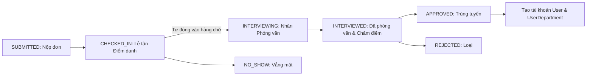
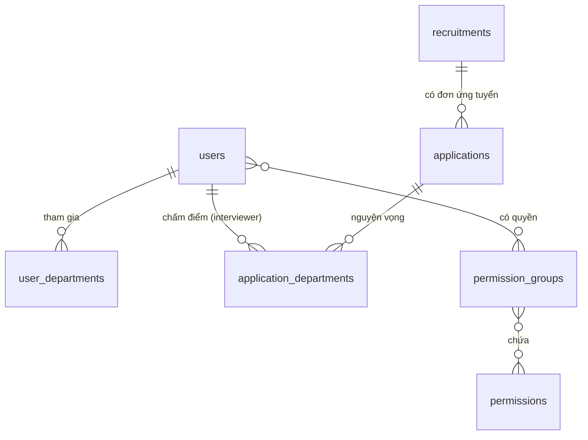

# iStar Backend — Tổng quan & Phân tích Hệ thống

Tài liệu kỹ thuật tổng hợp kiến trúc, mô hình dữ liệu, quy tắc nghiệp vụ, cấu hình và danh sách API của hệ thống **iStar Backend**.

---

## 1. Tổng Quan Dự Án

**iStar Backend** là hệ thống REST API phục vụ quản lý nhân sự, cơ cấu tổ chức và quy trình tuyển chọn thành viên của Câu lạc bộ iStar (Đại học Công nghiệp Hà Nội).
Hệ thống hỗ trợ cơ chế: phân quyền động theo nhóm quyền, ứng viên đăng ký nhiều ban, thành viên tham gia nhiều ban, quản lý đợt tuyển và quy trình điểm danh / phỏng vấn.

### Cơ cấu Ban trong Câu lạc bộ
Hệ thống chuẩn hóa gồm đúng 4 ban chính (loại bỏ hoàn toàn cấu trúc ban con `SubDepartment`):
1. **`MUSIC`**: Ban âm nhạc
2. **`RAP`**: Ban rap
3. **`MEDIA_AND_EVENT`**: Ban Truyền thông và tổ chức sự kiện
4. **`DANCE`**: Ban vũ đạo

### Công nghệ sử dụng
- **Backend Framework**: Java 21, Spring Boot 4.x (Spring Data JPA, Spring Security).
- **Database & Auditing**: PostgreSQL, Spring Data JPA Auditing (`@EnableJpaAuditing`, `@CreatedDate`, `@LastModifiedDate`).
- **Authentication**: Stateless JWT (JJWT `0.12.6`), BCrypt Password Encoder.
- **File Management & Export**: Local Upload (Cấu hình qua `app.upload.dir`), Apache POI (SXSSF streaming export Excel), Hibernate Validator.

---

## 2. Quy Tắc Nghiệp Vụ & Ràng Buộc (Business Rules)

### 2.1. Phân định Quyền hạn (`Permission`) và Chức vụ (`Position`)

- **`Permission` & `PermissionGroup`**: Quyền được phân bổ qua nhóm quyền (ví dụ: `ADMIN`, `RECEPTIONIST`, `INTERVIEWER`, `REVIEWER`). Các API được bảo vệ bởi `@PreAuthorize("hasAuthority('...')")`.
- **`Position`** (Chức danh trong Ban / CLB): Nằm trong `UserDepartment`, xác định vị trí của thành viên trong từng ban (ví dụ: `DEPARTMENT_HEAD`, `VICE_DEPARTMENT_HEAD`, `MEMBER`).
  - Các chức vụ cấp cao của CLB (như `PRESIDENT`, `VICE_PRESIDENT`) có giới hạn số lượng toàn câu lạc bộ và ràng buộc về khu vực (không thuộc cơ sở `NINH_BINH`).
  - `DEPARTMENT_HEAD` giới hạn tối đa 1 người / ban.
  - Một tài khoản có thể đảm nhiệm các chức danh khác nhau ở các ban khác nhau (ví dụ: Trưởng ban ở Sự kiện nhưng là Thành viên ở Âm nhạc).

### 2.2. Cơ cấu Đa Ban (Multi-Department) & Cơ chế Đồng bộ Ban (Reconciliation)
- **1 User ↔ Nhiều Ban**: Mỗi thành viên (User) có thể tham gia nhiều ban khác nhau thông qua bảng trung gian `user_departments`.
- **1 Đơn ↔ Nhiều Ban**: Mỗi ứng viên (Application) có thể nộp nguyện vọng vào nhiều ban khác nhau thông qua bảng `application_departments`.
- **Cơ chế Đồng bộ Ban (`UserDepartment` Reconciliation)**: Bảng `user_departments` có ràng buộc duy nhất `(user_id, department)`. Khi cập nhật thông tin user, Hibernate `ActionQueue` ưu tiên thực thi các lệnh INSERT trước DELETE trong cùng phiên làm việc, nếu chỉ thực hiện `clear()` và thêm mới sẽ gây lỗi vi phạm khóa duy nhất (`duplicate key value violates unique constraint`). Hệ thống áp dụng cơ chế điều phối tập hợp tại chỗ (in-place reconciliation):
  1. Xóa các ban cũ không còn trong yêu cầu (`removeIf` kích hoạt `orphanRemoval = true`).
  2. Cập nhật `position` của các ban đang giữ nguyên (thực hiện lệnh UPDATE, không xóa bỏ thực thể cũ).
  3. Chỉ INSERT các ban thực sự mới phát sinh.
  Đảm bảo không bao giờ xảy ra lỗi trùng lặp khóa duy nhất trên cơ sở dữ liệu.

### 2.3. Quy trình Tuyển ứng viên (Application Flow)
Mỗi đợt tuyển sinh (Recruitment) được quản lý với thời gian bắt đầu và kết thúc (`startDate`, `endDate`, `isActive`). Hệ thống tự động gán đơn đăng ký mới vào đợt tuyển đang mở.



### 2.4. Kiểm soát Đồng thời & Chống Ghi đè Trạng thái (Optimistic Locking)
- **Vấn đề giải quyết**: Tránh trường hợp 2 tài khoản cùng mở 1 đơn đăng ký và cùng lúc update trạng thái (Lost Update / Race condition) dẫn đến việc người gửi sau ghi đè kết quả của người gửi trước mà không hay biết.
- **Giải pháp triển khai**:
  - Tích hợp `@Version` (Optimistic Locking) trên cả bảng `Application` và `ApplicationDepartment`. Mọi thao tác cập nhật sẽ tự động có điều kiện `WHERE id = ? AND version = ?`.
  - Nếu phiên bản dữ liệu bị thay đổi bởi người khác trước đó, giao dịch của người sau sẽ lập tức bị chặn và quăng lỗi xung đột dữ liệu (HTTP 409 Conflict: `Dữ liệu đã được cập nhật bởi một người dùng khác trong lúc bạn thao tác. Vui lòng tải lại trang để xem trạng thái mới nhất!`).
  - Hỗ trợ các câu lệnh cập nhật nguyên tử có điều kiện trạng thái kỳ vọng (`updateStatusIfExpected`) trong `ApplicationRepository` và `ApplicationDepartmentRepository`.

---

## 3. Mô Hình Dữ Liệu (Database Schema)



### 3.1. Các bảng liên quan đến Người dùng & Phân quyền
- **`users`**: Chứa thông tin đăng nhập (`username`, `password`, `email`), thông tin cá nhân và trường học/khóa học.
- **`user_departments`**: Bảng trung gian lưu chức danh (`position`) và ban (`department`) của user.
- **Bảng phân quyền**: `permissions`, `permission_groups`, `user_permission_groups`, `group_permissions`.

### 3.2. Các bảng liên quan đến Tuyển sinh
- **`recruitments`**: Lưu thông tin đợt tuyển (`id`, `name`, `startDate`, `endDate`, `isActive`, `isDeleted`).
- **`applications`**: Chứa thông tin ứng viên (họ tên, email không bắt buộc phải duy nhất, trường lớp) và liên kết tới `recruitment_id`.
- **`application_departments`**: Bảng trung gian nguyện vọng của ứng viên. Lưu trạng thái (`status`), `interviewScore` (điểm phỏng vấn), `interviewNotes` (ghi chú), và liên kết tới người phỏng vấn (`interviewer_id`).

### 3.3. Bảng Danh mục dùng chung (Master Data / Common Code)
- **`common_codes`**: Quản lý danh mục cấu hình động (ví dụ: Trường/Khoa `SCHOOL`, Ngành học `MAJOR`...), gồm `category`, `code`, `name`, `description`, `order_index`, `is_active`. Cho phép Admin thêm/sửa/ẩn trường học mà không cần deploy lại code.

---

## 4. Danh Sách API Endpoints

### 4.1. Xác thực & Public (`/api/auth`, `/api/public`)
- `POST /api/auth/register`: Đăng ký thành viên mới (hỗ trợ `username` duy nhất).
- `POST /api/auth/login`: Đăng nhập, trả về JWT Token. Hỗ trợ truyền vào `username` là **Tên đăng nhập** HOẶC **Email** cá nhân (`CustomUserDetailsService` + `findByUsernameOrEmailAndIsDeletedFalse`).
- *Cấu hình Seeder*: Tự động khởi tạo tài khoản Quản trị viên mặc định (`admin` / `admin@istar.club` / `admin123`) với vai trò `ADMIN` và nhóm quyền `ADMIN` nếu hệ thống chưa có.
- `POST /api/auth/applications`: Nộp đơn ứng tuyển online (tự gán đợt tuyển đang active).
- `PUT /api/auth/applications/{id}`: Cập nhật đơn ứng tuyển.
- `DELETE /api/auth/applications/{id}`: Xóa đơn ứng tuyển (Soft delete).
- `POST /api/auth/applications/{id}/upload-avatar`: Tải lên ảnh thẻ ứng viên.
- `GET /api/public/common-codes?category=SCHOOL`: Lấy danh sách các trường đang hoạt động để đổ dropdown trên giao diện.

### 4.2. Cá nhân người dùng (`/api/users`) — *Authenticated*
- `GET /api/users/me`: Xem hồ sơ cá nhân (kèm danh sách `userDepartments`).
- `PUT /api/users/me`: Cập nhật hồ sơ cá nhân.
- `PUT /api/users/me/change-password`: Đổi mật khẩu.

### 4.3. Quản trị hệ thống (`/api/admin`)
Yêu cầu các quyền (Permission) tương ứng cho từng hành động.

- **Danh mục mã cấu hình (`/api/admin/common-codes`)**: Xem danh sách, tạo mới, sửa thông tin, bật/tắt kích hoạt, xóa mã danh mục.
- **Thành viên (`/api/admin/users`)**:
  - `GET /api/admin/users`: Lấy danh sách tất cả user phân trang (`page`, `size`).
  - `POST /api/admin/users/search`: Tìm kiếm user nâng cao theo từ khóa, ban, chức vụ, khóa, trạng thái (`UserSearchCriteria`).
  - `GET /api/admin/users/{id}`: Xem chi tiết thông tin user.
  - `PUT /api/admin/users/{id}`: Cập nhật thông tin user (thông tin cá nhân, vai trò, chức vụ, cơ sở, và danh sách ban tham gia `userDepartments`).
  - `DELETE /api/admin/users/{id}`: Xóa mềm user đơn lẻ (`isDeleted = true`). Quyền: `PERM_USER_DELETE`.
  - `PUT /api/admin/users/{id}/deactivate`: Vô hiệu hóa tài khoản user đơn lẻ (`isActive = false`). Quyền: `PERM_USER_EDIT`.
  - `PUT /api/admin/users/{id}/activate`: Kích hoạt lại tài khoản user đơn lẻ (`isActive = true`). Quyền: `PERM_USER_EDIT`.
  - `PUT /api/admin/users/bulk-deactivate`: **[MỚI]** Vô hiệu hóa hàng loạt tài khoản người dùng (`isActive = false`) theo danh sách `userIds` (`BulkUserActionRequest`). Quyền: `PERM_USER_EDIT`. Tương thích với thanh thao tác hàng loạt phía Next.js frontend.
  - `POST /api/admin/users/bulk-delete`: **[MỚI]** Xóa mềm hàng loạt tài khoản người dùng (`isDeleted = true`) theo danh sách `userIds` (`BulkUserActionRequest`). Quyền: `PERM_USER_DELETE`. Tương thích với thanh thao tác hàng loạt phía Next.js frontend.
  - `GET /api/admin/users/filters/positions`: Lấy danh mục Position để đổ dropdown bộ lọc.
  - `GET /api/admin/users/filters/departments`: Lấy danh mục 4 ban chính (`MUSIC`, `RAP`, `MEDIA_AND_EVENT`, `DANCE`) để đổ dropdown bộ lọc.
  - `GET /api/admin/users/filters/courses`: Lấy danh sách các khóa thực tế có trong CSDL phục vụ bộ lọc.
- **Thế hệ (`/api/admin/generations`)**: CRUD thông tin Gen CLB.
- **Đợt tuyển (`/api/admin/recruitments`)**: CRUD Recruitment, Đóng / Mở đợt tuyển (chỉ 1 đợt active tại 1 thời điểm).
- **Tuyển sinh / Xét duyệt (`/api/admin/applications`)**: 
  - Search/Filter (họ tên, email, đợt tuyển, trạng thái, ban).
  - Duyệt đơn (`approve`), Từ chối đơn (`reject`).
  - Tạo tài khoản (`create-account`) từ đơn đã duyệt (tự động tạo `User` và các `UserDepartment` tương ứng).
  - Xuất danh sách Excel (`export-excel`).

### 4.4. Quy trình Lễ tân (`/api/reception`)
- **Check-in đơn**: `PUT /api/reception/applications/{id}/checkin` - Đổi trạng thái đơn thành `CHECKED_IN`, đơn đi vào hàng chờ phỏng vấn.
- **Báo vắng mặt**: `PUT /api/reception/applications/{id}/no-show` - Đổi trạng thái đơn thành `NO_SHOW`.

### 4.5. Quy trình Phỏng vấn (`/api/interview`)
- **Hàng chờ phỏng vấn**: `GET /api/interview/queue` - Trả về danh sách nguyện vọng `CHECKED_IN` thuộc các ban mà người gọi API (Interviewer) đang quản lý/tham gia.
- **Nhận phỏng vấn**: `PUT /api/interview/applications/{appDeptId}/start` - Bắt đầu phỏng vấn (`INTERVIEWING`), gán interviewer.
- **Lưu kết quả**: `PUT /api/interview/applications/{appDeptId}/complete` - Chấm điểm, ghi chú và chuyển sang `INTERVIEWED`.

---

## 5. Cấu Hình Ứng Dụng (`application.properties`)

```properties
# File Upload Configuration
app.upload.dir=uploads
spring.servlet.multipart.max-file-size=10MB
spring.servlet.multipart.max-request-size=15MB
```

---

## 6. Đề Xuất Cải Tiến Kỹ Thuật (Roadmap)

1. **Email Notification Service**:
   - Tích hợp `JavaMailSender` tự động gửi email thông báo kết quả phỏng vấn, và gửi email tài khoản/mật khẩu khi lễ tân tạo tài khoản từ đơn.
2. **Lưu trữ đám mây (Cloud Storage)**:
   - Thay thế local storage cho `upload-avatar` và `upload-cv` bằng Cloudinary hoặc AWS S3.
3. **Phân quyền mềm (Data-level Authorization)**:
   - Tự động filter kết quả trả về tương ứng với danh sách ban mà trưởng ban phụ trách khi xem danh sách thành viên/ứng viên.
